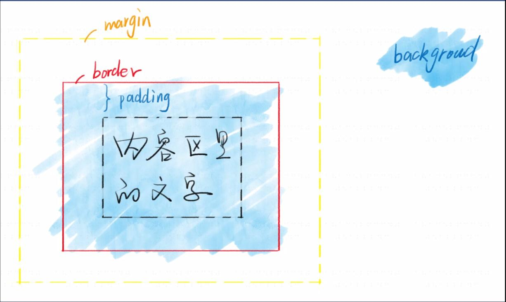
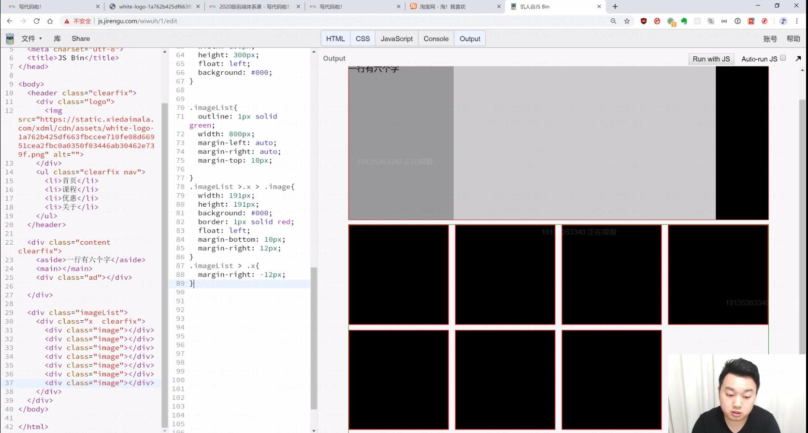
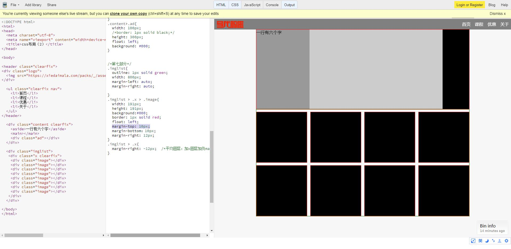

* 语法1：样式语法：(区分大小写)

选择器 ｛
    属性名:属性值;
    /*注释*/
｝

* 语法2: at语法：
```
@charset "UTF-8";       //声明字符编码
@import url(2.css);     //导入额外的css文件
@media (min-width: 100px) and (max-width: 200px) {
    语法1
}                       //媒体查询
```
<font color="red">注意事项：
1. @charset 必须放在第一行
2. 前两个at语法必须以分号;结尾
</font>
3. @media语法会单独教学
4. charset是字符集，但UTF-8识字符编码encoding，这是历史遗留问题:unicode字符集(全球统一)--utf-8/16/32，charset只能确定文件编码而不是字符集，因为不知道是8/16/还是32

* 调试css：
  1. w3c css validator验证器(没人用)
  2. VS Code看颜色
  3. WebStorm看颜色
  4. 开发者工具看警告

* 如何使用开发者工具：
  1. 找到你脑中的标签
  2. 看他是否有选择器
  3. 看他的样式是否被划掉
  4. 看他的样式是否有警告

<font color=red><strong>
* Border调试法
```
border:1px solid red;
```
    1. 怀疑某个元素有问题，就在这个元素后加border
    2. border没出现，说明选择器或者语法错了
    3. boeder出现了，看看边界是否符合预期
    4. bug解决了才可以把border删了
    5. 相当于js log调试法
</strong>
</font>

* 查资料：
    1. goodle搜索关键字 加 MDN
    2. 关键字 加 css trick
    3. 关键字 加 张鑫旭的博客

* 练习素材：
    1. PSd：Freepik搜索PSD web；365PSD里的UI套件
    2. 效果图（不提供下载）：dribbble.com顶级设计师区（搜索  web），可以用肉眼模仿他
    3. 商业网站：直接模仿你常去的网站

* 标准：css spec


* 快速顺序输入标签：
```
span{第$个span元素}*8
span.ib{第$个inline-block元素}*8
div>div>div       /*嵌套*/
va:t(m)              /*去除图片多余背景色*/
div.ad            /*class*/
```

* 文档流：
    1. 流动方向
        * inline元素从左到右，到达最右边才会换行  （span默认）
        * block元素从上到下，每一行都另起一行（div默认）
        * inline-block也是从左到右，但每行最后不会分开
 
    2. 宽度
        * inline宽度为内部inline元素的和，不能用width指定
        * block默认自动计算宽度，可用width指定
        * inline-block结合前两者的特点，可用width

    3. 高度
        * inline高度由行高（line-height）<em>间接</em>确定（还有字体），跟height或padding无关(line-height写在div、span都可，行高会继承）（行盒）
        * block高度由内部文档流元素决定，可以设height
        * inline-block跟block相似，可以设置height
```
//line-height

<div><span>span元素</span></div>

span{
  border: 1.5px solid red;
  padding: 10px 20px;
  line-height: 100px;    //实际高度
}

div{
  border: 1.5px solid green;
  line-height: 100px;
}

body{
  padding: 20px;
}
    
```
* overflow溢出：
   当内容的宽度或高度大于容器，会溢出，overflow显示滚动条
    overflow：auto / scroll（丑不用） / hidden / visible (灵活/永远显示/隐藏/显示溢出部分)
    overflow可以分为overflow-x 和 overflow-y

* <font color="red">注意事项：  
    1. 一般情况，永远不要写 width="100%"，width默认值为auto 
    2. 溢出部分：overflow：auto / scroll / hidden (滚动/隐藏)
    3. 如果div里没有内容则高度为0；span则不是
    4. 滚动条只在第一屏显示，其他的留空

    </font>
```
    style="width: 100%";      
```


*脱离文档流：float ；
            position：absolute / fixed


* 盒模型
content-box width = 内容宽度
border-box width = 内容宽度 + padding + border

border-box更好用；同时指定padding，width，border就知道了
<font color="red">面试答法：css盒模型有两种，一种是content-box另一种是border-box，区别是content-box宽度只包含content；而border-box的宽度包含到border，内边距，内容(去除border的两像素：outline)</font>




* margin合并    
    1. 哪些情况会合并：父子margin；兄弟margin
    2. 如何阻止合并：
    * 父子合并用padding/border挡住
    * 父子合并用overflow：hidden挡住
    * 父子合并用display：flex,不知道为什么
    * 兄弟合并是符号预期的
    * 兄弟合并可以用inline-block消除
    3. 总之要一条一条死记, 而且css的属性逐年增多,每年都可能有新的     


     


* 基本单位:
  1. 长度单位：px像素；em相对于自身font-size的倍数；百分数；整数；rem；vw和 vh；其他
  2. 颜色：（用取色器）
       * 十六进制#FF6600或者#F60;
       * RGBA颜色rgb（0，0，0）或者如果rgba（0,0,0,1）; 
       * hsl颜色hsl（360,100%,100%）;(色相，饱和度，亮度)
  
* 彩虹
```
/*hmtl*/
<!DOCTYPE html>
<html>
<head>
  <meta charset="utf-8">
  <meta name="viewport" content="width=device-width">
  <title>JS Bin</title>
</head>
<body>
<div class="rainbow">
  <div>
    <div>
      <div>
        <div>
          <div>
            <div>
              <div>
                <div></div>
              </div>
            </div>
          </div>
        </div>
      </div>
    </div>
  </div>
</div>
</body>
</html>
```
```
/*css*/
*{box-sizing: border-box; padding:0px; margin:0px;}
body{
  /*border: 1px solid black;*/
  background: white;
}
.rainbow{
  /*border: 1px solid black;*/
  height: 200px;
  overflow: hidden;
}
.rainbow div{
  overflow: hidden;
}

.rainbow > div{
  
  width: 400px;
  height: 400px;
  background: red;
  border-radius: 50%;  //变圆
}
.rainbow > div > div{
 
  background: hsl(60,80%,50%);
  height: 380px;
  margin: 10px;
  border-radius: 50%;
}
.rainbow > div > div > div{
  
  background: hsl(120,80%,50%);
  height: 360px;
  margin: 10px;
  border-radius: 50%;
} 
.rainbow > div > div > div > div{
  
  background: hsl(180,80%,50%);
  height: 340px;
  margin: 10px;
  border-radius: 50%;
}
.rainbow > div > div > div > div > div{
 
  background: hsl(240,80%,50%);
  height: 320px;
  margin: 10px;
  border-radius: 50%;
}
.rainbow > div > div > div > div > div > div{
 
  background: hsl(300,80%,50%);
  height: 300px;
  margin: 10px;
  border-radius: 50%;
}
.rainbow > div > div > div > div > div > div > div{
 
  background: hsl(330,80%,50%);
  height: 280px;
  margin: 10px;
  border-radius: 50%;
}
.rainbow > div > div > div > div > div > div > div > div{
  
  background: hsl(330,80%,100%);
  height: 260px;
  margin: 10px;
  border-radius: 50%;
}
```

* css布局
  * 布局分类：
    1. 固定宽度布局，一般宽度为960/1000/1024 px
    2. 不固定宽度布局，主要靠文档流的布局原理来布局（文档流本来就是自适应的，不需要加额外的样式）
    3. 响应式布局，就是pc上固定宽度，手机上不固定宽度，也就是一种混合布局
  * 布局思路：
    1. 从大到小：先定下大局，然后完善每个部分的小布局
    2. 从小到大；先完成小布局，然后组合成大布局
    3. 新人推荐第二种，因为小的简单；老手推荐第二种，因为熟练有大局观


* float布局（IE唯一知识点，面试可用）
    * 步骤：子元素上加float：left和width；<font color="red">在父元素上加 .clearfix </font>
    * 经验：
        1. 有经验者会留一些空间或者最后一个不设width
        2. 不需要做响应式，因为手机上没有IE，而这个布局是专门为IE准备的 
        3. IE 6/7存在双倍margin bug，解决方法有两个：
            1. 将错就错，针对6/7把margin减半
            2. 神来一笔，在加一个display：inline-block
    

```
//脱离文档流再进入文档流
<header class="clearfix">
  <div class="logo">XDML</div>
  <nav>导航</nav>
  <div class="user">文超</div>
</header>

.clearfix:after{      /*进入文档流*/
  content: '';
  display: block;
  clear: both;
}
```


* 实践
  
  https://jsbin.com/pararixapu/1/edit?html,css,output"
1. 不同布局：用float做两栏布局（顶部条）；三栏布局（内容区）；四栏布局（导航）；平均布局（产品展示区）<平均图层：中间加x图层加负margin>。淘宝曾用双飞翼布局，已过时。
2. 经验：
    * 加上头尾即可满足所有的PC页面需求
    * 手机页面傻子才用float布局
    * float要程序员自己计算宽度，不灵活
    * float用来应付IE足以

```
//html
<!DOCTYPE html>
<html>
<head>
  <meta charset="utf-8">
  <meta name="viewport" content="width=device-width">
  <title>css布局（2）</title>
</head>
  
<body>
  
<header class="clearfix"> 
<div class="logo">
  
</div>
  
  <ul class="clearfix nav">
    <li>首页</li>
    <li>课程</li>
    <li>优惠</li>
    <li>关于</li>
  </ul>
</header>
 
  <div class="content clearfix">  
    <aside>一行有六个字</aside>
    <main></main>
    <div class="ad"></div>  
  </div>
  
  <div class="imglist">
   <div class="x clearfix">
    <div class="image"></div>
    <div class="image"></div>
    <div class="image"></div>
    <div class="image"></div>
    <div class="image"></div>
    <div class="image"></div>
    <div class="image"></div>
    <div class="image"></div>
   </div>
  </div>
  
</body>
</html>
```
```
//css
*{margin:0; padding:0; box-sizing:border-box;}
ul,ol{
  list-style: none;
}

/*第三部分*/
img{max-width: 100%;}

/*第二部分 + 第五部分*/
.clearfix::after{
  content: '';
  display: block;
  clear: both;
}

/*第三部分*/
.logo{
  background: grey;
  display: inline-block;
  float: left;  /*先顶部对齐*/
  margin-top: 8px;  /*再中间对齐*/
  margin-left: 10px;
}
.logo>img{
/*width: 100px;*/
/*border: 1px solid red;*/
  height: 26px;
  vertical-align: middle;  /*去除图片下方多余背景色*/
}
.nav{
  float: right;  /*再顶部完全对齐*/
  margin-left:20px;
}

/*第一部分*/
ul>li{
  float: left;
/*border: 1px solid red;*/
  padding: 4px 0.5em;
  line-height: 32px;    /*使其能与图片对齐的像素*/
}
ul{
/*border: 1px solid green;*/
  display: inline-block;
}

header{
  background: grey;
  color: white;
}

/*第四部分*/
.content{
  /*border: 1px solid red;*/
  
  /*第五部分*/
  /*800！=200+500+100*/
  /*《方法一》由于border-box使得实际宽度为border+width，
  因为border存在多了2px，因此要删去border*/
  
  /*《方法二》border改成outline*/
  outline: 1px solid red;
  width: 800px;
  margin-left: auto;
  margin-right: auto;
  /*居中*/
  /*防止margin: 0 auto;覆盖上下边距*/
}
.content>aside{
  width: 200px;
  height: 300px;
  /*border: 1px solid green;*/
  float: left;
  background: #999;/*第六部分去border，加背景色*/
}
.content>main{
  /*border: 1px solid purple;*/
  height: 300px;
  width: 500px;
  float: left;
  background: #ccc;
}
.content>.ad{
  width: 100px;
  /*border: 1px solid black;*/
  height: 300px;
  float: left;
  background: #000;
}


/*第七部分*/
.imglist{
  outline: 1px solid green;
  width: 800px;
  margin-left: auto;
  margin-right: auto; 
  
}
.imglist > .x > .image{
  width: 191px;
  height: 191px;
  background:#000;
  border: 50px solid red;
  float: left;
  margin-top: 10px;
  margin-bottom：10px;
  margin-right: 12px;
}
.imglist > .x{
  margin-right: -12px;  /*平均图层：加x图层加负margin*/
}
```
* 我的bug:未出现bottom边距




* Flex布局：
  1. display:flex
  2. flex-direction:row / column
  3. flex-wrap:wrap
  4. just-content:center / space-between
  5. align-items:center
* 经验：
  1. width和height在PC一般写死，在手机端不写死
  2. 用min-width/max-width/max-height/min-height
  3. flex可以满足基本需求
  4. flex和margin-xxx：auto配合有意外的效果
* 写死：width：100px；

  不写死：width:50%；max-width；width:30vw
* 游戏：https://flexboxfroggy.com/#zh-cn
* 实践：https://jsbin.com/ciyoyikuyu/edit?html,css,output
```
/*html*/
<!DOCTYPE html>
<html>
<head>
  <meta charset="utf-8">
  <meta name="viewport" content="width=device-width">
  <title>JS Bin</title>
</head>
<body>

  <header class="header"> 
<div class="logo">
  
</div>
  
  <ul>
    <li>首页</li>
    <li>课程</li>
    <li>优惠</li>
    <li>关于</li>
  </ul>
</header>
  
<div class="content">
<aside>一行有六个字</aside>
<main></main>
<div class="ad"></div>
</div>
    
  <div class="imglist">
   <div class="x"> 
    <div class="image"></div>
    <div class="image"></div>
    <div class="image"></div>
    <div class="image"></div>
    <div class="image"></div>
    <div class="image"></div>
    <div class="image"></div>
    <div class="image"></div>
   </div>
  </div>
  
</body>
</html>
```
```
/*css*/
*{margin:0; padding:0; box-sizing:border-box;}
ul,ol{
  list-style: none;
}
img{max-width: 100%;}

.header{
  display: flex;
  justify-content: space-between;  /*另一种方式加在ul*/
  align-items: center;
  background: grey;
  padding: 4px 0;
}

.logo{
  display: flex;
  align-items: center;
}
.logo>img{
  height: 26px;
  vertical-align: middle;
}

ul{
  /*margin-left: auto;*/
  display:flex;
}
ul>li{
  padding: 4px;
}

.content{
  display: flex;
  width: 800px;
  margin-left: auto;
  margin-right: auto;
}
.content > aside{
  background: #000;
  width: 200px;
}
.content > main{
  background: #666;
  height: 400px;
  flex-grow: 1;
}
.content > .ad{
  background: #999;
  width: 100px;
}

.imglist{
  width: 800px;
  margin-left: auto;
  margin-right: auto;
  margin-top: 10px;
}
.imglist > .x{
  display: flex;
  flex-wrap: wrap;
  margin-right: -6px;
  margin-left: -6px;
}
.image{
  width: 191px;
  height: 191px;
  background: grey;
  border: 1px solid red;  
  margin-right: 6px;
  margin-left: 6px;
  margin-bottom: 10px;
}
```

* 草图软件：Balsamiq；Figma；墨刀；Adobe XD
